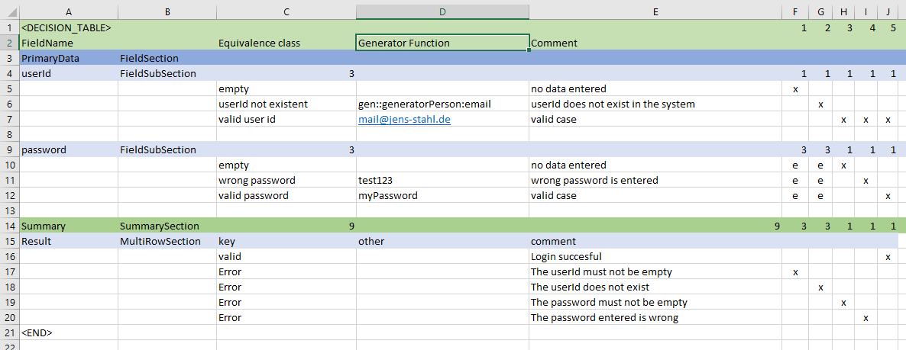

= Quickstart
:toc:

==== Overview
This tutorial will show you the steps in order to get started quickly in setting up test data generation. A simple
example is shown in this guide to provide a quick overview and a first impression of Nanook.
For a more detailed description please check our tutorial and the user manual.

==== The equivalence class table

The test cases are defined in an "equivalence class table" ("ECT"). The name equivalence class table is chosen because it contains
classes considered to cause equivalent behavior within an application. For example a class "not empty field"
behaves the same way no matter which characters and how many characters are provided.

In this quickstart guide we will look at the simple example of a login dialogue. The ECT can
be created with LibreOffice, Microsoft Office, or Google Spreadsheet.

The below image shows the equivalence class table representing a login dialogue.

The user can enter a user name and a password.

For the user-id we have three equivalence classes:

* empty
* userId not existent
* valid user id

The password has the equivalence classes:

* empty
* wrong
* valid password

These classes will result in a maximum of 3*3=9 test cases. In this example we would like to generate test data for all
of these test cases.

The test case definitions can be found in columns F to J. If we take a closer look at test case 1 (column F) we see that equivalence
class "empty" of field "userId" is marked with an "x". "x" means to choose exactly this equivalence class of this field.
The three equivalence classes of the password field are marked with an "e". "e" means to choose any of the equivalence
classes of this field randomly. In the summary section you see the expected result of this test case. The test case should make
sure that no matter what you enter into the password field, the error "The userId must not be empty" appears, as long
as the userId is empty.

Columns G to J cover the other test cases we would like to cover.

==== Generating test data

Finally we generate the test data on basis of the just created table.
In order to do so the repository "quickstart-source" has to be cloned with the command

----
 git clone https://github.com/xhubioTable/quickstart-source.git
----
and data generation is started by calling
----
yarn install
----
This will install all required dependencies. For more information on yarn check: https://yarnpkg.com/en/
----
node src/quickstart.js
----
from the root folder of the project. For more information on node.js check https://nodejs.org/en/

In our example the test data will be generated in form of five JSON files (one for each testcase) that can be found in the folder "tdg".
Test data generation is based on the "Generator Function" column of our ECT. It is possible to define static
data as done for the class "valid user id" or dynamic data using a generator function like shown for the "userId not
existent" class. The corresponding data generator for email generation is present in the "src"-folder (GeneratorPerson.js)
and used in the quickstart.js file.

