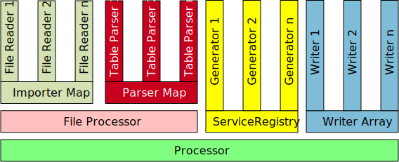

Put it all together. The following picture shows the correlation of
all parts of Nanook.

=== File Reader
A file reader is responsible for reading spread sheet files and for providing
a generic interface for a parser. There is a file reader which is
able to read Microsoft Excel files and another reader may read OpenOffice
documents.

=== Importer Map
The file readers are registered in a map by the file extension they
handle. For example: +
The Excel file reader is registered with the extensions 'xls' and 'xlsx'.
So the same reader may be registered multiple times.

=== Table Parser
The table parser is responsible for reading a table format. There is a
parser to read the equivalence class table and another one to read the
matrix table format.

=== Parser Map
Each parser is registered in a map by the table it understands. For example the
equivalence class table reader is registered with the key '<DECISION_TABLE>'.
This key must be in the first cell of the table. The same parser may be registered
under different keys.

=== File Processor
The file processor takes a file name as input. Then it extracts the extension and checks if an
importer is registered for this extension. If so, the file is read. One file (a workbook) may
contain multiple tables. The file processor reads the first cell of each table and checks if a
parser is registered for this table type. Each table no parser is registered for is being ignored.

If a parser is registered for this kind of table, the file processor gives over the table to
the parser. The result of parsing is a table model.

All the table models are stored in an array.

=== Generator
A generator is responsible for generating data. The generator returns a value or may directly
change or insert data to the given 'tescaseData' object.

=== Service Registry
All the generators are registered in a 'ServiceRegistry'. The name under which the generator is registered is
the same name that is used in the table to call the generator. Also, each generator has access to the service
registry and can call other generators this way.

=== Writer
A writer is responsible to create the output data in the format needed for the test. All the generated data
is stored internally in a JSON structure. This object may be exported to many files with different format
and content. This is the domain of the writer.

=== Writer Array
All the writers are stored in an array. For each test case all the writers are called in the order they are stored
in the array.

=== Processor
The processor glues everything together. It gets the tables from the 'File Processor', then it executes all the tables
with the help of the generators and writers.
