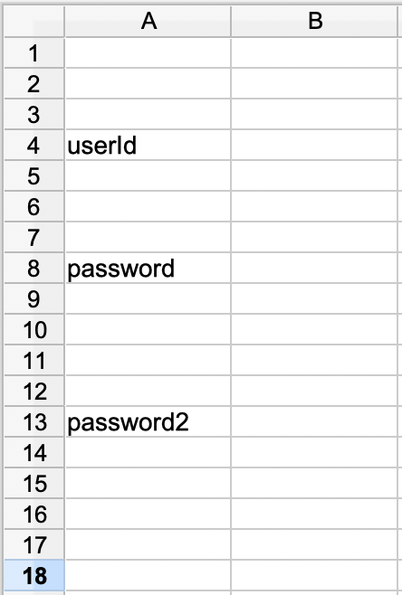

== Create an initial table
Create an empty spread sheet and enter all the fields from the specification.
When entering the fields leave some rows between each field.
The following fields should be entered in the first column.

. userId
. password
. password2

The sheet should look similar to this:

