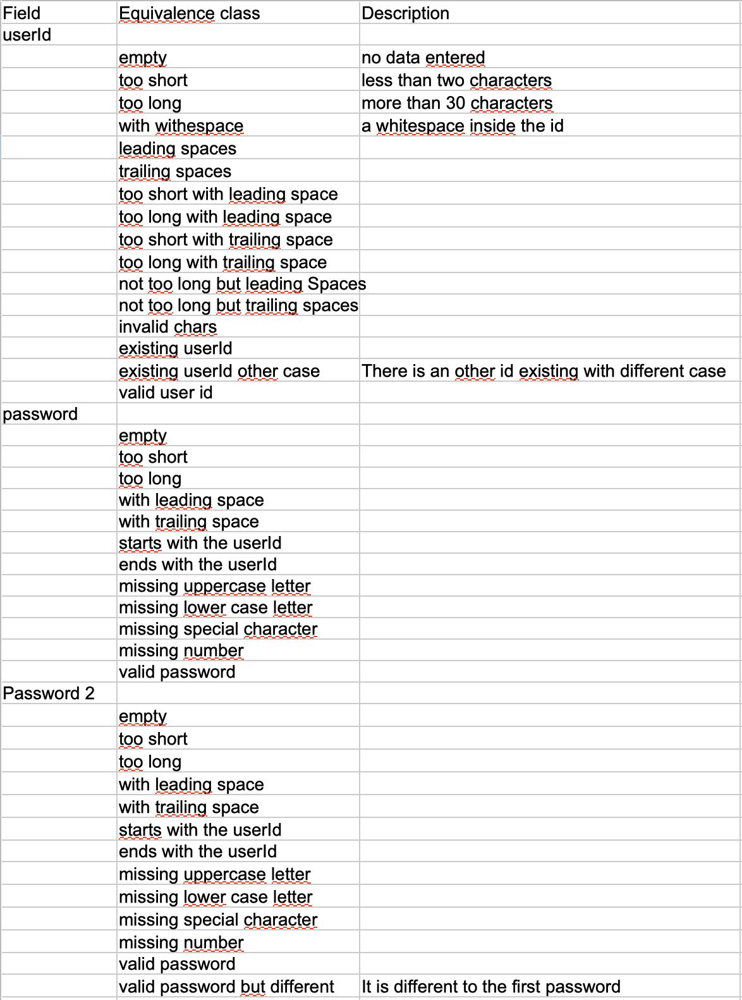

== Fill the equivalence class data
For each field we need to create the equivalence classes.
This is a value to which the application behaves equivalent to.

Example 'too many characters'::
The application reacts in the same way if there is one character too much or if there are 20 characters too much.

To get these values you need to read the specification and extract the classes from it.
All the classes should be added to the spread sheet in the second column under the field it belongs to.
In the third column we have the possibility to enter a description for the class.
Let's start with the user id.

userID equivalence classes::
* empty +
No values entered at all.

* too short +
The spec says: 'The id must have a minimum length of two characters.'

* too long +
The id must not exceed 30 characters

* id with space +
The spec says: 'The user id must not contain a space' so we need to create an id containing a space.

* leading space +
An id with leading space or spaces. As the id will be trimmed we also should consider a too short ID with leading
space. We expect that the application checks the length after trimming.

* too short but with leading space or spaces

* trailing space or spaces

* too short but with trailing space or spaces

* not too long but leading Spaces +
The user id without the spaces matches the max length constraint.

* not too long but trailing spaces

* invalid chars +
Spec: 'Only ascii characters are allowed (a-z) and also numbers, hyphen, and underscore'.

* existing userId +
spec: 'The id must not exist.'

* existing userId different case +
spec: 'The user name is case insensitive.'

* valid user id +
Finally we need a valid user Id.

password equivalence classes::
Some of the classes can be copied more or less from the user id field.

* empty
* too short
* too long
* with leading space +
In this case the application will not trim the spaces since they are not allowed.
* with trailing space +
* starts with the userId
* ends with the userId
* missing uppercase letter
* missing lower case letter
* missing special character
* missing number
* valid password

password2 equivalence classes::
In this case we can copy all the classes from the first password field and
add some additional classes.

* empty
* too short
* too long
* with leading space +
In this case the application will not trim the spaces since they are not allowed.
* with trailing space +
* starts with the userId
* ends with the userId
* missing uppercase letter
* missing lower case letter
* missing special character
* missing number
* valid password
* valid password but different to the first password

Now the table should look like this:

Also note the added header row.