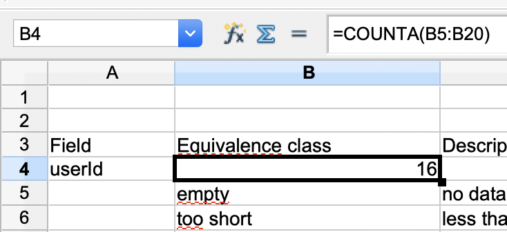

== Add calculations and prettify the table
Now that we have all the equivalence classes filled by field, we are able to
calculate how many test cases are necessary to test this functionality.

In order to do so, we multiply the number of equivalence classes of each field.

* userid has 16 classes
* password has 12 classes
* password2 has 13 classes

So the number of test cases is 16*12*13 = 2496.
This is a lot to test. Could this be optimised? If yes, how
to optimise it without losing test coverage? This is the main
benefit of the equivalence class table technique.

First, we will add some formulas to the spreadsheet to do the calculations.

The numbers count the amount of classes in each field. Do this for each of the fields.
Also add a row at the end which shows the result of the multiplication.

image::images/tutorials/t1/step3_format.png[width=620]

As you can see in the picture there are also some colours added to the rows.
At the right side we added four new columns with the names 1, 2, 3 and 4.
These are the test case columns. Each column represents one test case.
The formula from column B is copied into each of the new test case columns.
As there is no value entered in the column it shows '0' for all of the columns.
