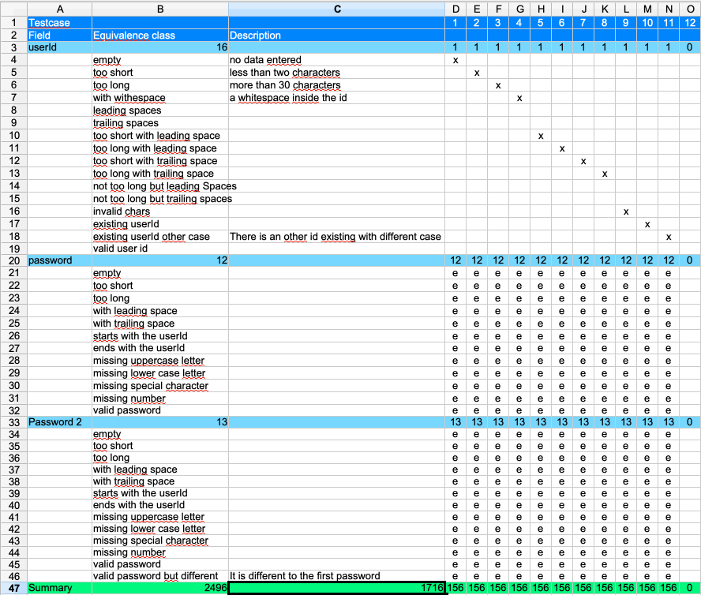

== Start filling the table with decisions
The table is prepared and ready to be used.
Let's start making decisions.

We need to choose one equivalence class per field and combine
them.

It also makes it easier to enter an additional formula in the 'result' row 'C47'.
The formula sums up all results in the 'Summary' row '=SUM(D47:W47)'.

=== Test case 1
From the field 'userId' we just choose the first row with the class 'empty'.
To do this enter an 'x' in the column 'D'.

We expect that when no userId is given it doesn't matter what we will enter
in 'password' or 'password2'; the application will react in the same way.
So let's enter this information into the table.

Enter for all the classes of field 'password' and for 'password2' an 'e'.

[NOTE]
====
* 'x' means to choose exactly this equivalence class of this field.
* 'e' means choose any of the equivalence classes for this field.
====

The result is shown in the last row named 'Summary'. There we can see
'156'. So this test case eliminates 156 test cases of the total possible number of '2496'.

Now you can repeat this with the second test case.

=== Test case 2
Choose 'to short' for the userId and do the same as for test case '1' for the rest
of the fields.

And again we have 156 test cases done.

=== Test case 3 to 11
You can do the same pattern for all the cases where a value in 'userId' causes
an error. In each of these cases the value entered in the password fields
is not relevant.

In column 'C' in row '47' we can see that these 11 test cases are covering
1716 cases. The goal of the table is to get a coverage of 100%. We need to add
more test cases to cover all of them. But as the table fills up the amount
of test coverage per test case will decrease.
