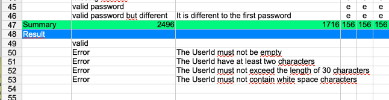
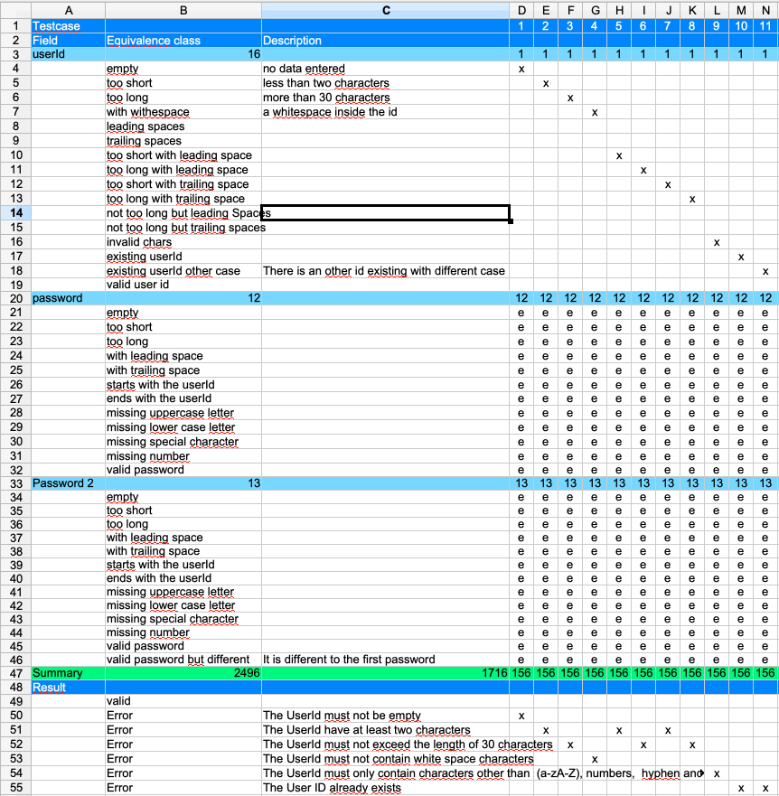

== Add a result section
Until now we have defined what we think how the application
behaves but it is not shown in the table. For this add new rows
under the 'Summary' row.

Add the following rows
----
Result
	Valid
	Error	The UserId must not be empty
	Error	The UserId must have at least two characters
	Error	The UserId must not exceed the length of 30 characters
	Error	The UserId must not contain white space characters
----

The result section is not necessary to fill the equivalence class
table, but it is a possibility to define the expected error messages
for the application. It has also a documentation purpose.

For each test case we can now specify the expected behaviour.

