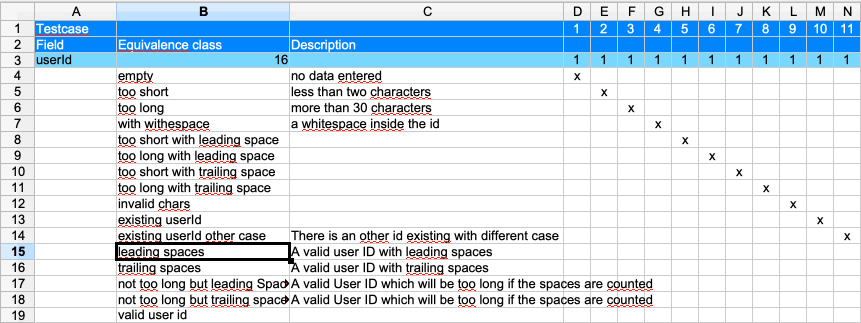
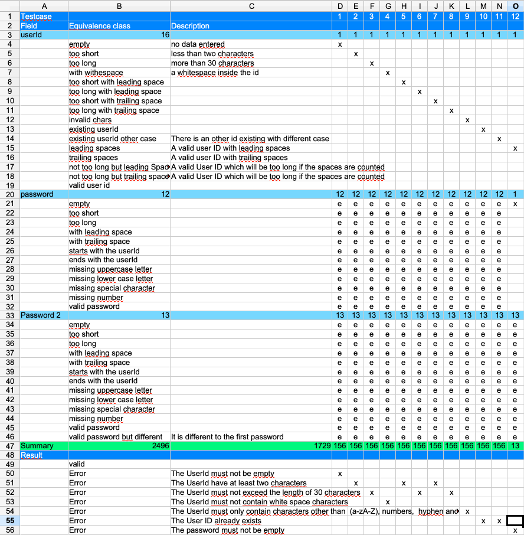
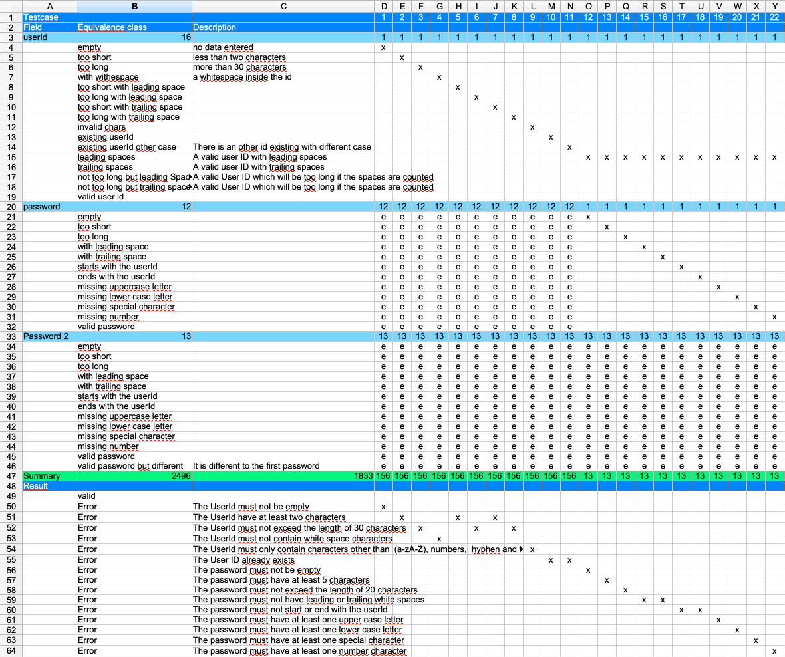

<<<
== Cleanup the table
As the table grows it will be more difficult to build combinations.
So it is very helpful that the table follows a certain pattern (which is not always possible).
In our case we started with the invalid user ids. But in the rows
8,9,14,15 and 19 there are valid cases.

It makes sense to reorder the equivalence classes so that the fields representing
valid cases are at the end of the table.

Also more descriptions are added in order to make clear that these are valid cases.

Now it is time to combine the first valid user Id with the different possibilities
of 'password' and 'password2'.

<<<
=== Testcase 12
Choose the 'leading spaces' equivalence class of field 'userId' or any other equivalence class as long as
it is a valid one.
In 'password' choose the 'empty' class. As the 'password' is a mandatory
field we can fill the 'password2' field with 'e'.

And then add a new result row with the expected error messages.

In the table you can now use the same logic for 'password' as we have done
for 'userId' before. So fill up the next test cases for all the error cases of
'password'.

