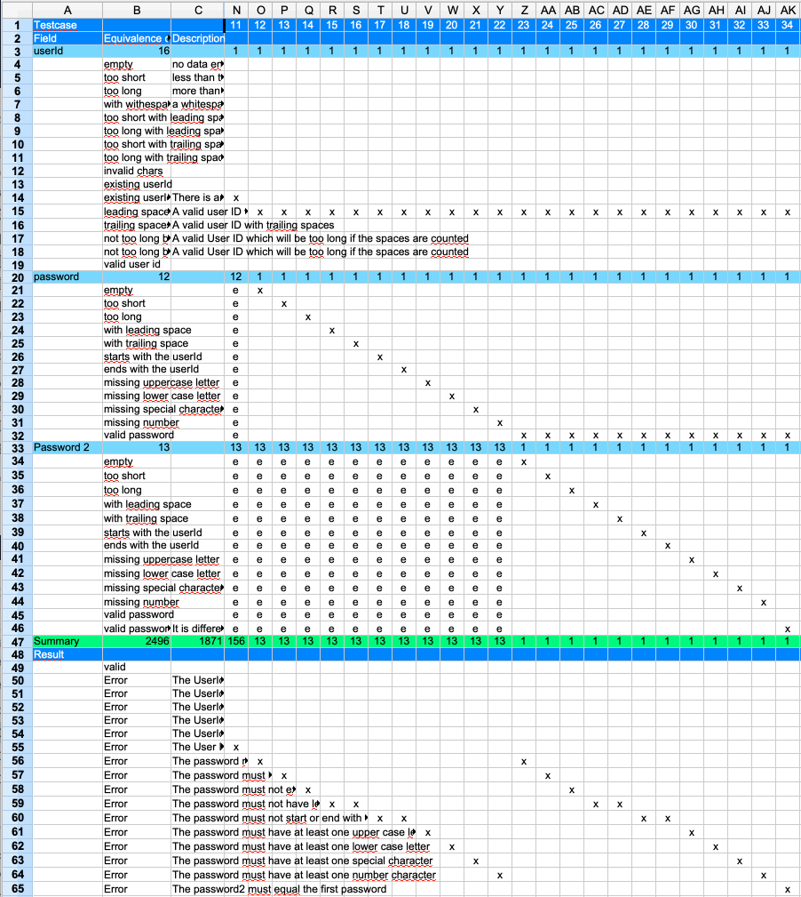

<<<
== Iterate over the 'password2' field

The following procedure depends on how the application reacts. Will it first proof that the password2
is different to the first password field or does it first do the same checks
as for the first password.

In this example we do the full iteration of all the classes also for password2.
Take the valid class of 'password' and create a test case for all the error
cases of 'password2'

Now the table should look like this:

We also added a new error message for the case where the passwords are different.
When adding new test cases remember to update the formula for summarizing
the created test cases.
