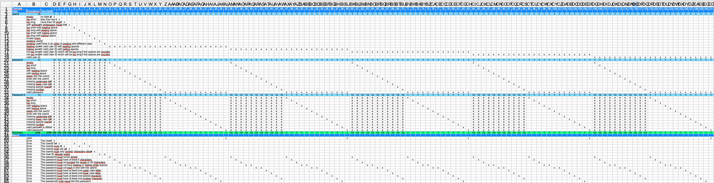
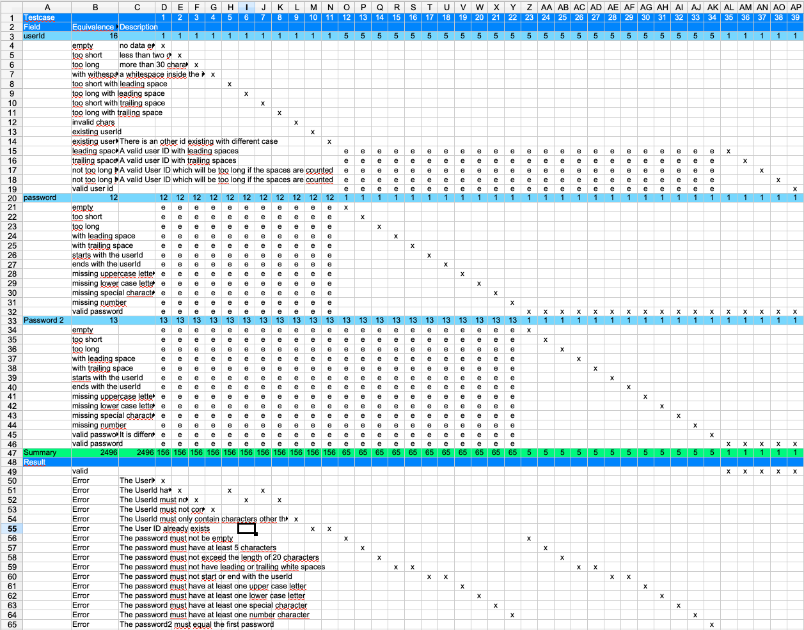

== Reorder the rows for 'password2'

After filling out the cells for password2 we can see that the second to last
row is a valid case but the last row is an invalid case. So these two rows should
be swapped.

Now we should fill out the valid case. This would be test case 35.
After this we can see that still 624 test cases are missing. This is
because of the missing rows in 'userId'. There we have five different kinds
of valid cases. One of them we have used for the error cases of 'password' and
'password2'. To complete the equivalence class table we have two possibilities:

. Copy the columns with the test cases 12-35 and insert them four times. Then
change the equivalence class for the 'userId' so that all cases are covered.
This results in 131 test cases.

The picture gives an idea of how this looks like.

<<<
To optimise the testing procedure we should consider not to iterate over all of the valid cases to check the errors of 'password'
and 'password2'. We can just take any valid userId instead. For this we fill all the cells of the rows 15-19
with the test cases 12-34 with an 'e'. Then we only iterate the valid cases. This results in 39 test cases.

