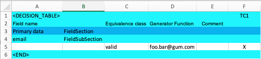

== Create the first table for data generation
In this step we create a simple table with static data generation.

=== Create table
As the current implementation reads Excel Spreadsheets create a new Excel file.

* Set the sheet identifier +
The parser only considers sheets which have the right identifier set in the first cell.
So enter '<DECISION_TABLE>' in the first cell.

* Set the column header +
Enter the following column headers in the second row.

[cols=2*,options="header"]
|====
|Column|Column header
|A|Field Name
|B|
|C|Equivalence class
|D|Generator Function
|E|Comment
|====

* Create the first section (FieldSection) +
A 'FieldSection' contains 1..n 'FieldSubSection' elements.
Add a new row with the following columns

[cols="1,3,6",options="header"]
|====
|Column|Data|Description
|A|Primary Data| A name for this 'FieldSection'
|B|FieldSection| The 'FieldSection' Identifier.
|====

* Create a 'FieldSubSection' +
For this example we take an email field.
Add a new row with the following columns

[cols="1,3,6",options="header"]
|====
|Column|Data|Description
|A|email| The name of the data field
|B|FieldSubSection| The 'FieldSubSection' Identifier.
|====

* Create the equivalence class for the email field +
In this example we just create one class.
Add a new row with the following columns

[cols="1,3,6",options="header"]
|====
|Column|Data|Description
|A| | Leave empty
|B| | Leave empty
|C|valid| The name of this class. 'valid' indicates that we create a valid email
|D|foo.bar@gum.com| The value to be generated
|E| | Leave empty
|F|X| The x tells the processor that this equivalence class is chosen.
|====

Add a name for the test case of column 'F' in the first row.
Just add 'TC1' or any other name you like.

* Mark the end row of the table +
To tell the processor that the table ends an identifier needs to be set.
Add a new row with the following columns

[cols="1,3,6",options="header"]
|====
|Column|Data|Description
|A|<END>| This identifier marks the last row of the table. All content
below is ignored.
|====

* Last but not least, add some colour to the table.

