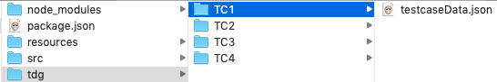

<<<
== Create your own generator

First of all we need to update the Excel sheet to use the
new generator.

image::images/tutorials/t2/step4.png[]

As you can see in the image we added two new 'FieldSubSection'. Also three more
test cases are added just to make it more interesting.

Also we removed the static email and replaced it with a generator call.
We used the same generator three times with different parameter.

Let's create a generator which creates a person data record.
The data to be generated is: +

* firstName

* lastName

* email

We would like to have an email generated out of the first name and the last name
of the person. And the generated emails must be unique.

Create a new file called /src/GeneratorPerson.js. The generator
extends the 'DataGeneratorBase' class.

[source,js]
----
const DataGeneratorBase = require('@xhubiotable/data-generator').DataGeneratorBase

class GeneratorPerson extends DataGeneratorBase {

}
----

<<<
Then add a method to create the data we need. The generator should create a
person object with a unique email address.

[source,js]
----
async _doGenerate(instanceId, testcase, todoGenerator) {
  const firstName = FIRST_NAMES[Math.floor(Math.random() * FIRST_NAMES.length)];
                               <1>

  const lastName = LAST_NAMES[Math.floor(Math.random() * LAST_NAMES.length)];
                               <2>

  const domain = FREE_MAILER[Math.floor(Math.random() * FREE_MAILER.length)];
                               <3>

  const email = this.makeUnique(firstName, lastName, domain)
                               <4>

  return {                     <5>
    firstName,
    lastName,
    email
  }
}

// ensure that the email is unique
makeUnique(firstName, lastName, domain) {
  let email = `${firstName}.${lastName}@${domain}`
  let counter = 1
  while (this.uniqueSet.has(email)) {
                              <6>
    email = `${firstName}.${lastName}-${counter}@${domain}`
    counter++
  }
  return email
}
----
<1> The first name is chosen out of an array with first names
<2> The last name is chosen out of an array with last names
<3> Choose a random domain
<4> Depending on the size of the name and domain arrays the chance to create
duplicate email addresses is high. So we need a way to make the email unique
but the names should still be included.
<5> Return the person object.
<6> The 'DataGenerator' has an internal SET which is used to store the values which need to be unique.
The Generator now returns a person object, but in our table we would like to have
an 'email' or a 'firstName' not an object.

<<<
Create another function to return strings in for the given parameter.

[source,js]
----
async generate(instanceId, testcase, todoGenerator) {
  const param = todoGenerator.config      <1>

  if (instanceId && this.instanceData.has(instanceId)) {
                                          <2>
    const valObj = this.instanceData.get(instanceId)
    return valObj[param]
  }

  const genData = await this._doGenerate( <3>
    instanceId,
    testcase,
    todoGenerator
  )
  if (genData !== undefined && instanceId) {
                                          <4>
    this.instanceData.set(instanceId, genData)
  }
  return genData[param]                   <5>
}
----
<1> Get the parameter from the excel sheet. The parameter tells the generator
for which field the data should be created.
<2> Here we see the instanceId in action. Each time the generator is called
with the same instanceId it will return the same data. In our case we call the same
generator three times with a different parameter. The generator should return fields from the
same object.
<3> If there is no data for the instanceId it will create a new one.
<4> Store the newly generated data under the current instanceId.
<5> Return the new data.

<<<
Now let's have a look at the generated result.
In the 'tdg' sub folder are four sub directories 'TC1' to 'TC4'.
For each test case one folder was created.

Open one of the generated JSON files in one of the folders.
The result should look like this.

[source,json]
----
{
  "tableName": "Sheet1",
  "name": "TC1",
  "data": {
    "Sheet1": {
      "a9dad54a-c12e-46d8-914e-926b32e82424": {
        "first name": "Anastasia",     <1>
        "last name": "Lukoschek",      <2>
        "email": "Anastasia.Lukoschek@hotmail.com"
                                       <3>
      }
    }
  },
  "instanceId": "a9dad54a-c12e-46d8-914e-926b32e82424",
  "callTree": {
    "instanceId": "364c485f-d863-490c-8600-b419f4504ad1",
    "tableName": "Sheet1",
    "testcaseName": "TC1",
    "children": []
  }
}
----
<1> The generated first name
<2> The generated last name
<3> The email build out of the first name and the last name

Now each time the processor is called it will create new data for the four test cases and the data will always change.
Also the email will always be unique.

[NOTE]
The example code is located at: +
src/t2/step4 +
Just type there: +
node tdg.js
