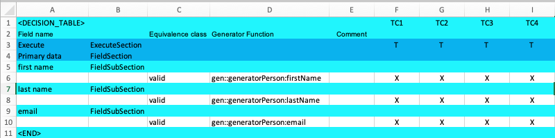

== Execute Section
This section gives you the possibility to switch on/off single test cases.
If the section does not exists all test cases are executed. If the section
exists, only the marked test cases are executed.

Add a new row in row '3' of the Excel sheet.

[cols="1,3,6",options="header"]
|====
|Column|Data|Description
|A|Execute| A name for this 'ExecuteSection'
|B|ExecuteSection| The 'ExecuteSection' Identifier.
|F-I|T| The indicator if the test case should be executed. (F/T) Values are allowed.
|====

As all the test cases have a 'T' in there column, all the test cases are executed. If you change
some of them to 'F' then these test cases are not executed.

[NOTE]
The example code is located at: +
src/t3/step1 +
Just type there: +
node tdg.js
