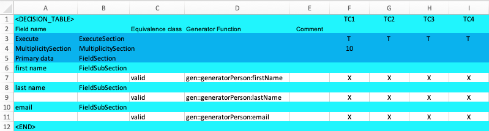
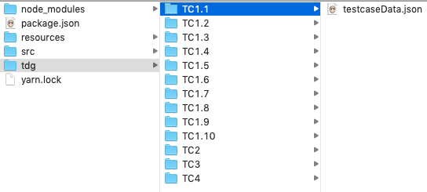

== Multiplicity Section
This section gives you the possibility to multiply the execution of one test case.
This is often useful when you test with random data. As an example, you might like to test
if the UI could handle a bunch of naughty strings. If you only choose one string it might
work. But it is more useful to test many of them.

Add a new row in row '4' of the Excel sheet.

[cols="1,3,6",options="header"]
|====
|Column|Data|Description
|A|Multiply| A name for this 'MultiplicitySection'
|B|MultiplicitySection| The 'MultiplicitySection' Identifier.
|F|10| The count of how often this test case should be created.
|====

Try it out.

[NOTE]
The example code is located at: +
src/t3/step2 +
In there, simply run: +
node tdg.js

As you can see, in the folder 'tdg' there are now 10 test cases for test case one. Also the test cases TC2-TC4 have been generated.
If no multiplication value is given, it defaults to one.

