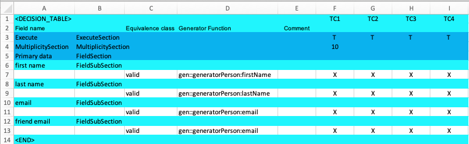

== Using the 'instanceId'
As discussed before in this tutorial, if a generator is called with the same instanceId, it will return the
same data. But what if we would like to add a new field called 'friend email'? This would be the email of a friend. In this
case we would like to get a new email, not the same.

Let's add a new field to our table.
Add a new row for the FieldSubSection and one row for the equivalence class of this field.
Just copy the email field rows and add them. Then rename 'email' to 'friend email'.

The table should looks like this:

[NOTE]
The example code is located at: +
src/t3/step3 +
Just type there: +
node tdg.js

Now generate the data and have a look at the created JSON file.
The fields 'email' and 'friend email' have the same value.
To change this behaviour, we need to unify the instanceId for this email.
So edit the generator command for 'friend email'.

From :
----
gen::generatorPerson:email
----

to:

----
gen:1:generatorPerson:email
----
The '1' is an instanceId suffix. It will be added to the instanceId of the
current test case. This ensures that the instanceId is unique again.
Generate the data and have a look at the generated JSON file. The two emails
should now be different.

[NOTE]
The example code is located at: +
src/t3/step3.1 +
In there, simply run: +
node tdg.js
